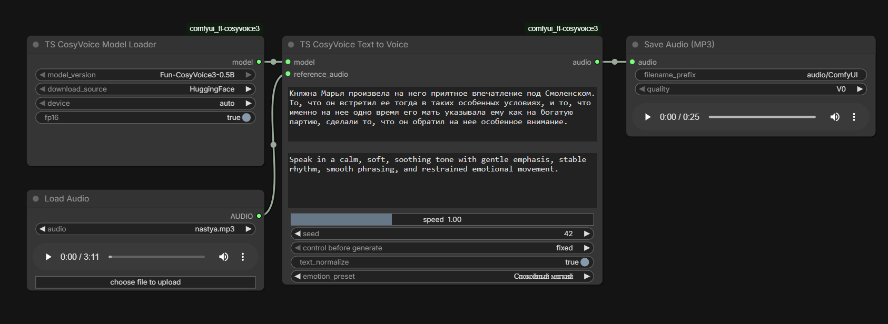
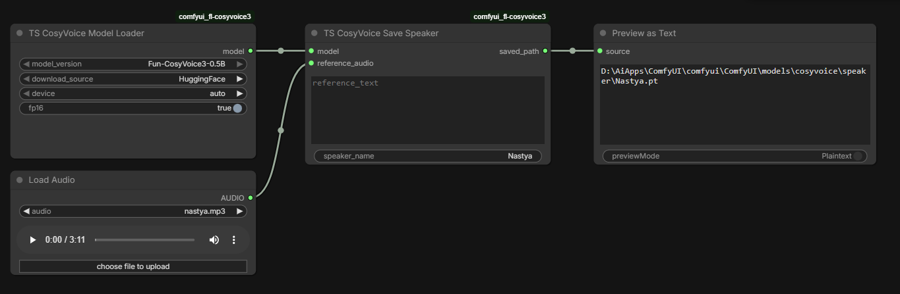
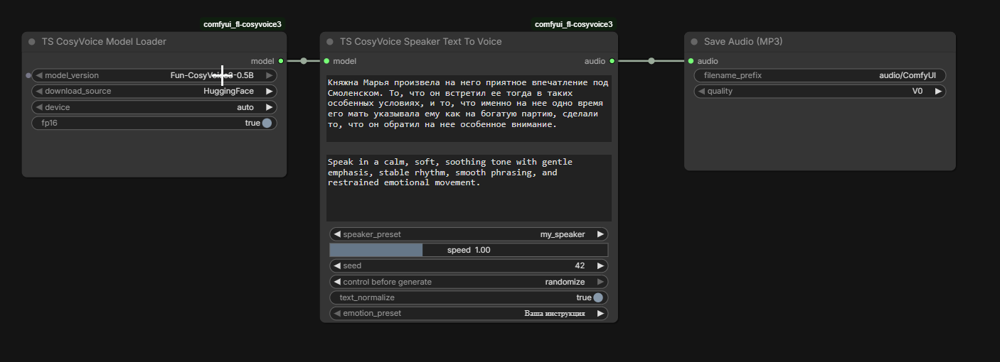
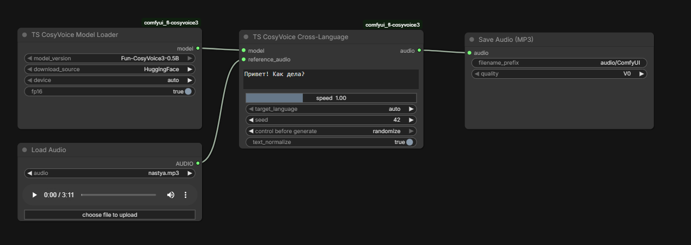
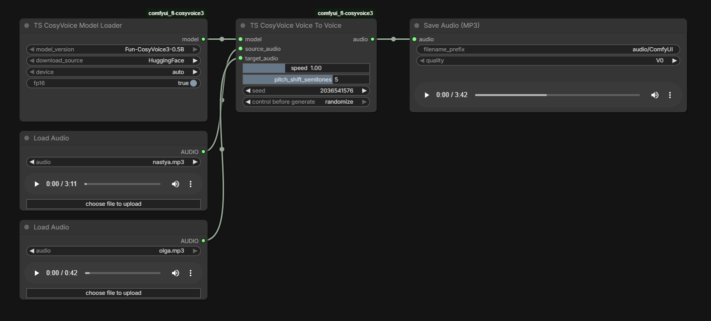
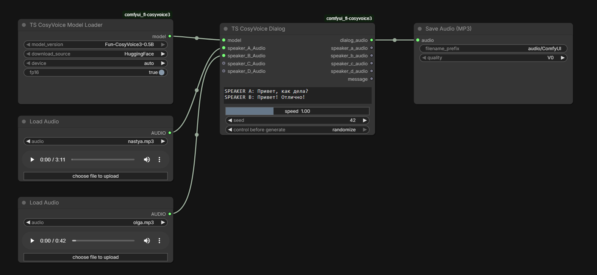

# TS CosyVoice for ComfyUI

  

  <b>Русский</b> | <a href="#english">English</a>

---

## Русский

TS CosyVoice for ComfyUI - это набор удобных нод для синтеза речи, клонирования голоса, кросс-языковой генерации, диалогов и voice-to-voice конвертации на базе **CosyVoice 3**.

Пак старается быть дружелюбным в повседневной работе:

- автоматически подготавливает референсное аудио под формат модели;
- умеет сохранять голоса как пресеты;
- поддерживает длинное аудио в voice conversion через чанки;
- добавляет эмоциональное управление через текстовые инструкции;
- держит интерфейс простым и понятным прямо внутри ComfyUI.

### Быстрый старт

1. Установите зависимости из `requirements.txt`.
2. Перезапустите ComfyUI.
3. Добавьте ноду `TS CosyVoice Model Loader`.
4. Загрузите модель `Fun-CosyVoice3-0.5B`.
5. Подключите загрузчик к нужной ноде синтеза.

### Что умеет пакет

- `TS CosyVoice Model Loader` - скачивает и загружает модель CosyVoice 3.
- `TS CosyVoice Text to Voice` - синтезирует речь по тексту с опорой на референсный голос и эмоцию.
- `TS CosyVoice Save Speaker` - сохраняет голос как готовый пресет для повторного использования.
- `TS CosyVoice Speaker To Audio` - генерирует речь из текста с уже сохраненным пресетом голоса.
- `TS CosyVoice Speaker Text To Voice` - генерирует речь с сохраненным голосом и дополнительной эмоцией/инструкцией.
- `TS CosyVoice Cross-Language` - озвучивает текст на другом языке, сохраняя тембр референса.
- `TS CosyVoice Voice To Voice` - конвертирует одно аудио в другой тембр.
- `TS CosyVoice Dialog` - собирает многоголосый диалог из нескольких референсных голосов.

---

## Ноды

### 1. TS CosyVoice Model Loader

Главная входная точка пакета. Эта нода:

- скачивает модель из HuggingFace или ModelScope;
- проверяет, что ключевые файлы модели не повреждены;
- загружает модель на `GPU` или `CPU`;
- поддерживает `fp16`, если устройство это позволяет.

Когда использовать:

- всегда в начале любого workflow с TS CosyVoice;
- если вы хотите один раз загрузить модель и потом использовать ее в нескольких ветках графа.

Совет:

- режим `auto` обычно лучший выбор, потому что старается использовать GPU в первую очередь.

### 2. TS CosyVoice Text to Voice

Эта нода превращает текст в речь по референсному голосу.

Что делает:

- берет `text` - то, что нужно озвучить;
- берет `reference_audio` - пример голоса;
- может применить `emotion_preset` или вашу собственную инструкцию;
- автоматически подрезает и нормализует референс под формат модели.

Подходит для:

- быстрого клонирования голоса;
- озвучки одного персонажа;
- эмоциональной TTS по тексту.

Скриншот:

Практический совет:

- для лучшего результата используйте чистый референс 5-15 секунд без музыки и фонового шума.

### 3. TS CosyVoice Save Speaker

Нода сохраняет голос в виде пресета, чтобы потом не загружать один и тот же референс снова и снова.

Что делает:

- берет `reference_audio`;
- при необходимости распознает `reference_text` автоматически через Whisper;
- извлекает speaker features;
- сохраняет пресет в папку `models/cosyvoice/speaker`.

Подходит для:

- библиотеки персонажей;
- постоянных голосов для сериала, подкаста или канала;
- более быстрого повторного синтеза.

Скриншот:

Совет:

- задавайте понятные имена вроде `narrator_female_soft` или `hero_male_dark`.

### 4. TS CosyVoice Speaker To Audio

Это быстрый синтез по уже сохраненному пресету голоса.

Что делает:

- берет `speaker_preset`;
- берет новый `text`;
- генерирует аудио без необходимости снова давать референсный файл.

Подходит для:

- серийной генерации фраз одним голосом;
- озвучки длинных проектов с постоянным спикером;
- сценариев, где референс уже один раз сохранен.

Когда выбирать эту ноду:

- если вам не нужны дополнительные эмоции и достаточно просто говорить голосом сохраненного персонажа.

### 5. TS CosyVoice Speaker Text To Voice

Похожа на предыдущую ноду, но добавляет управление подачей через эмоции и инструкции.

Что делает:

- использует уже сохраненный `speaker_preset`;
- синтезирует новый `text`;
- применяет `emotion_preset` или ваш `instruct_text`.

Подходит для:

- одного и того же персонажа в разных эмоциональных состояниях;
- дубляжа с разной манерой речи;
- ситуаций, где голос должен оставаться тем же, а эмоция меняться.

Скриншот:

Совет:

- если нужен стабильный тембр персонажа и при этом гибкая подача, это одна из самых удобных нод в паке.

### 6. TS CosyVoice Cross-Language

Нода для кросс-языковой озвучки.

Что делает:

- берет `reference_audio` на одном языке;
- озвучивает новый `text` на другом языке;
- сохраняет тембр и общий характер голоса.

Подходит для:

- локализации;
- мульти-язычных персонажей;
- тестов того, как один и тот же голос звучит на разных языках.

Скриншот:

Совет:

- если не уверены в языке, оставьте `target_language = auto`.

### 7. TS CosyVoice Voice To Voice

Нода для конвертации одного аудио в другой тембр.

Что делает:

- берет `source_audio` - исходную речь;
- берет `target_audio` - референс целевого тембра;
- при необходимости меняет `pitch`;
- режет длинное `source_audio` на умные чанки;
- склеивает результат обратно в единый файл.

Полезно для:

- смены тембра уже записанной речи;
- конвертации длинных дублей;
- постобработки существующего аудио.

Скриншот:

Особенности:

- `target_audio` автоматически ограничивается 30 секундами;
- длинное `source_audio` обрабатывается по чанкам;
- разрез старается не ломать речь посреди слова.

### 8. TS CosyVoice Dialog

Нода собирает многоголосый диалог в одном месте.

Что делает:

- принимает `dialog_text` со строками вида `SPEAKER A: ...`;
- использует отдельные голоса для `SPEAKER A`, `B`, `C`, `D`;
- генерирует как общий диалог, так и отдельные дорожки по спикерам.

Подходит для:

- сценок;
- визуальных новелл;
- роликов с несколькими персонажами;
- тестов взаимодействия голосов.

Скриншот:

Совет:

- если у вас только два персонажа, достаточно `SPEAKER A` и `SPEAKER B`.

---

## Полезные рекомендации

### Как выбрать хороший референс

- Лучше всего работает чистое моно-аудио без музыки и реверберации.
- Оптимальная длина обычно 5-15 секунд.
- Один голос на одном референсе почти всегда лучше, чем смесь нескольких голосов.

### Какой workflow использовать

- Нужен быстрый TTS по референсу: `Model Loader -> Text to Voice`
- Нужен постоянный персонаж: `Save Speaker -> Speaker To Audio`
- Нужна эмоция поверх сохраненного голоса: `Save Speaker -> Speaker Text To Voice`
- Нужна смена языка: `Model Loader -> Cross-Language`
- Нужна конвертация записанного аудио: `Model Loader -> Voice To Voice`
- Нужен диалог: `Model Loader -> Dialog`

### Где лежат speaker presets

Сохраненные голоса лежат в:

`ComfyUI/models/cosyvoice/speaker`

---

## Ограничения и ожидания

- Публичная модель в пакете - это `Fun-CosyVoice3-0.5B`.
- Для лучшего качества референсы все равно очень важны.
- Сильный шум, музыка и эхо в референсе заметно ухудшают результат.
- Voice conversion может быть тяжелой задачей на длинном аудио, особенно на CPU.

---

## English

  <a href="#русский">Русский</a> | <b>English</b>

TS CosyVoice for ComfyUI is a practical node pack for **CosyVoice 3** focused on text-to-speech, voice cloning, cross-language generation, dialogue building, and voice-to-voice conversion.

The pack is designed to feel comfortable in real workflows:

- it automatically prepares reference audio for the model;
- it lets you save voices as reusable presets;
- it supports long audio in voice conversion through chunking;
- it adds emotional control with text instructions;
- it keeps the UI straightforward inside ComfyUI.

### Quick start

1. Install dependencies from `requirements.txt`.
2. Restart ComfyUI.
3. Add `TS CosyVoice Model Loader`.
4. Load `Fun-CosyVoice3-0.5B`.
5. Connect the loader to any TS CosyVoice synthesis node.

### What the pack includes

- `TS CosyVoice Model Loader`
- `TS CosyVoice Text to Voice`
- `TS CosyVoice Save Speaker`
- `TS CosyVoice Speaker To Audio`
- `TS CosyVoice Speaker Text To Voice`
- `TS CosyVoice Cross-Language`
- `TS CosyVoice Voice To Voice`
- `TS CosyVoice Dialog`

---

## Nodes

### 1. TS CosyVoice Model Loader

This is the main entry point for the whole pack.

It can:

- download the model from HuggingFace or ModelScope;
- validate important model files;
- load the runtime on GPU or CPU;
- enable `fp16` when supported.

Use it:

- at the beginning of every TS CosyVoice workflow;
- when you want one loaded model shared by multiple branches.

### 2. TS CosyVoice Text to Voice

This node generates speech from text using a reference voice.

It:

- takes `text` as the content to speak;
- takes `reference_audio` as the voice example;
- lets you apply an `emotion_preset` or your own custom instruction;
- automatically trims and normalizes the reference for the model.

Best for:

- fast voice cloning;
- single-character narration;
- emotional TTS from plain text.

Screenshot:

Tip:

- clean reference audio around 5-15 seconds usually gives the best results.

### 3. TS CosyVoice Save Speaker

This node saves a reusable speaker preset.

It:

- takes `reference_audio`;
- can auto-transcribe `reference_text` with Whisper if needed;
- extracts speaker features;
- saves the result into `models/cosyvoice/speaker`.

Best for:

- reusable character libraries;
- recurring voices in long projects;
- faster repeated synthesis.

Screenshot:

### 4. TS CosyVoice Speaker To Audio

This is the simplest way to synthesize speech from a saved speaker preset.

It:

- loads `speaker_preset`;
- takes fresh `text`;
- generates audio without re-uploading a reference file.

Best for:

- production workflows with stable recurring voices;
- batch generation with the same speaker;
- lightweight character reuse.

### 5. TS CosyVoice Speaker Text To Voice

This node combines a saved speaker preset with emotional control.

It:

- uses an existing `speaker_preset`;
- speaks new `text`;
- applies either an `emotion_preset` or your own `instruct_text`.

Best for:

- one character with different moods;
- expressive dubbing;
- keeping voice identity stable while changing delivery.

Screenshot:

### 6. TS CosyVoice Cross-Language

This node is for cross-language voice generation.

It:

- takes `reference_audio` in one language;
- speaks `text` in another language;
- keeps the reference timbre and character.

Best for:

- localization;
- multilingual characters;
- comparing how one voice behaves across languages.

Screenshot:

### 7. TS CosyVoice Voice To Voice

This node converts one spoken recording into another timbre.

It:

- takes `source_audio`;
- takes `target_audio` as the target timbre reference;
- can apply pitch shifting;
- splits long source audio into smart chunks;
- stitches the final result back together.

Best for:

- changing the timbre of recorded speech;
- converting long spoken material;
- post-processing existing voice recordings.

Screenshot:

Notes:

- `target_audio` is automatically limited to 30 seconds;
- long `source_audio` is processed in chunks;
- chunking tries to avoid cutting speech in awkward places.

### 8. TS CosyVoice Dialog

This node builds multi-speaker dialogue from a script.

It:

- reads `dialog_text` lines like `SPEAKER A: ...`;
- uses separate voice references for `SPEAKER A`, `B`, `C`, and `D`;
- returns both the full dialogue and per-speaker audio tracks.

Best for:

- scenes;
- visual novels;
- character interaction tests;
- multi-voice content creation.

Screenshot:

---

## Practical tips

### Picking a good reference

- Clean audio works much better than noisy audio.
- 5-15 seconds is usually a very good range.
- A single clear speaker is almost always better than a mixed recording.

### Recommended workflow patterns

- Fast reference-based TTS: `Model Loader -> Text to Voice`
- Reusable character voice: `Save Speaker -> Speaker To Audio`
- Reusable character with emotion: `Save Speaker -> Speaker Text To Voice`
- Cross-language speech: `Model Loader -> Cross-Language`
- Recorded voice conversion: `Model Loader -> Voice To Voice`
- Multi-speaker scene: `Model Loader -> Dialog`

### Where speaker presets are stored

Saved speaker presets are stored in:

`ComfyUI/models/cosyvoice/speaker`

---

## Limits and expectations

- The public model used here is `Fun-CosyVoice3-0.5B`.
- Reference quality still matters a lot.
- Heavy noise, music, and reverberation can noticeably reduce output quality.
- Voice conversion on long audio can be demanding, especially on CPU.
