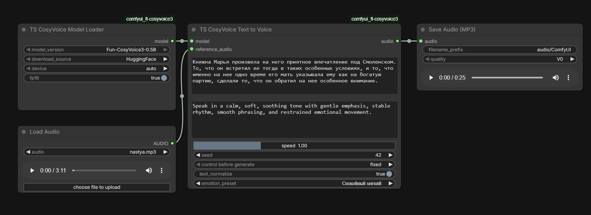
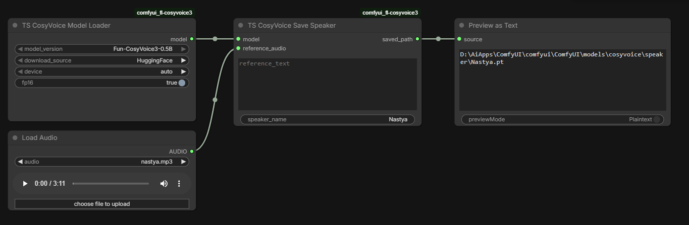
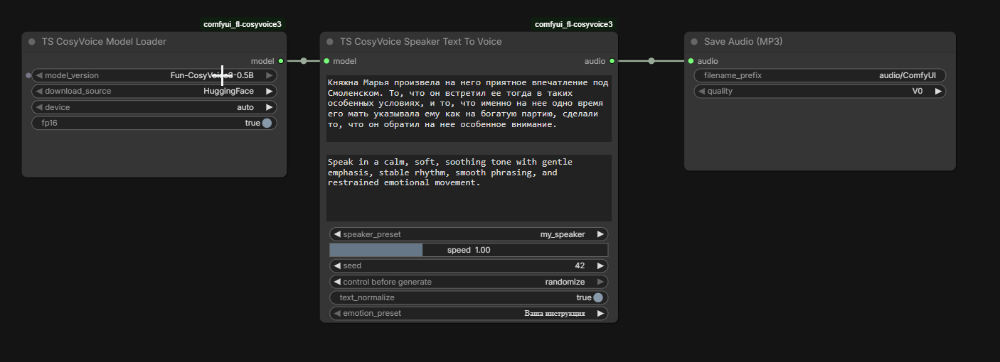
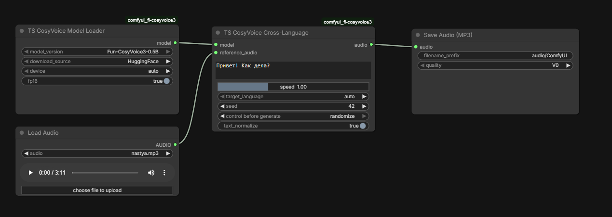
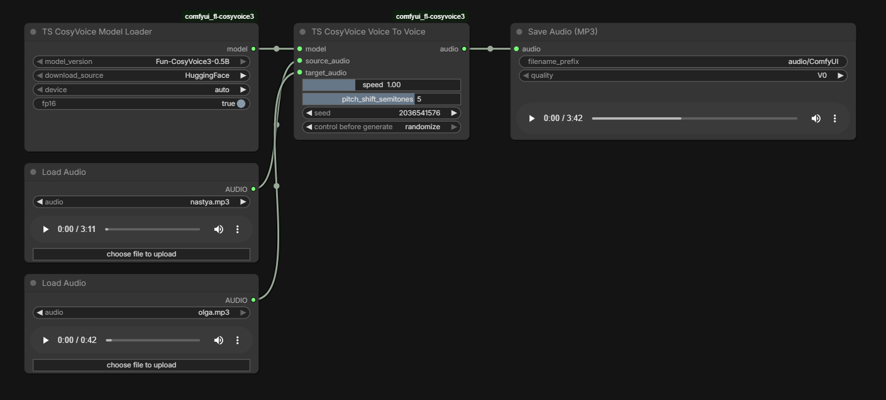
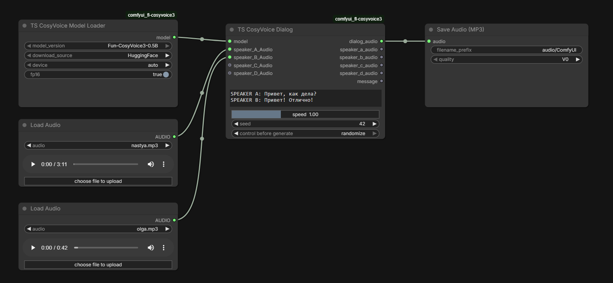

<div align="center">


# 🎙️ TS CosyVoice for ComfyUI

**Клонируйте голос. Меняйте эмоции. Локализуйте на 9 языков.**
**Соберите многоголосый диалог одним нодом — прямо в ComfyUI.**

[](./CHANGELOG.md)
[](./CHANGELOG.md)
[](./LICENSE)
[](https://huggingface.co/FunAudioLLM/Fun-CosyVoice3-0.5B-2512)

🇷🇺 **Русский** · [🇬🇧 English](#-english)

</div>

---

## 🎯 Что это и зачем

`TS CosyVoice` — это семь нод для ComfyUI, которые превращают модель **CosyVoice 3** в удобный инструмент озвучки. Подключаете загрузчик к нужной ноде синтеза — и работаете как с обычным графом ComfyUI, без танцев с командной строкой и `.yaml`-конфигами.

> [!TIP]
> Если коротко: **подсунули 5–15 секунд чистого голоса → получили любой текст этим голосом**, при необходимости — на другом языке, с другой эмоцией или в формате диалога.

---

## ✨ Что умеет пакет

<table>
<tr>
<td width="50%" valign="top">

### 🎤 Клонирование голоса
Любой текст — голосом из вашего референса (5–15 секунд аудио).

### 🎭 Управление эмоциями
12+ готовых пресетов или ваша собственная инструкция: «говори тепло и медленно», «звучи возбуждённо» и так далее.

### 🌍 Кросс-язык (9 языков)
Голос на русском читает английский текст. Или наоборот. Тембр сохраняется.

</td>
<td width="50%" valign="top">

### 🔊 Voice-to-Voice
Превратите запись одного голоса в запись другого голоса — с поддержкой длинного аудио через умный chunking.

### 🗣️ Многоголосый диалог
Скрипт `SPEAKER A: ... SPEAKER B: ...` → готовая сцена с отдельными дорожками каждого спикера.

### 💾 Speaker presets
Сохраняйте часто используемые голоса один раз — переиспользуйте бесконечно.

</td>
</tr>
</table>

---

## ⚡ Быстрый старт за 4 шага

```bash
# 1. Установите зависимости (внутри ComfyUI Python)
pip install -r requirements.txt
```

```text
# 2. Перезапустите ComfyUI
# 3. Найдите ноды в категории "TS CosyVoice3" через Add Node → search
# 4. Постройте граф:

   ┌─────────────────────┐         ┌──────────────────────┐         ┌──────────┐
   │ TS CosyVoice        │  model  │ TS CosyVoice         │  audio  │ Save     │
   │ Model Loader        │────────►│ Text to Voice        │────────►│ Audio    │
   └─────────────────────┘         └──────────────────────┘         └──────────┘
                                            ▲
                                            │ reference_audio
                                            │
                                       ┌────┴──────┐
                                       │ Load      │
                                       │ Audio     │
                                       └───────────┘
```

> [!NOTE]
> Модель `Fun-CosyVoice3-0.5B` (~1.5 ГБ) скачается автоматически при первом запуске `Model Loader` в `ComfyUI/models/cosyvoice/`.

---

## 🧩 Каталог нод

| Нода | Категория | Что делает | Когда использовать |
|------|-----------|------------|---------------------|
| 🚀 **Model Loader** | `Loaders` | Качает и держит модель в памяти | Всегда первой |
| 🎤 **Text to Voice** | `Synthesis` | TTS с референсом и эмоцией | Озвучка одного персонажа |
| 💾 **Save Speaker** | `Utilities` | Сохраняет голос как `.pt` пресет | Библиотека постоянных голосов |
| 🎭 **Speaker Text To Voice** | `Synthesis` | TTS из пресета + эмоция | Один персонаж в разных настроениях |
| 🌍 **Cross-Language** | `Synthesis` | Текст на другом языке голосом референса | Локализация |
| 🔊 **Voice To Voice** | `Synthesis` | Источник + целевой тембр → новый микс | Конвертация длинных записей |
| 🗣️ **Dialog** | `Synthesis` | Многоголосый диалог из скрипта | Сцены, визуальные новеллы |

### 📸 Как ноды выглядят в ComfyUI

<table>
<tr>
<td width="33%" align="center">
<br>
<sub><b>🎤 Text to Voice</b></sub>
</td>
<td width="33%" align="center">
<br>
<sub><b>💾 Save Speaker</b></sub>
</td>
<td width="33%" align="center">
<br>
<sub><b>🎭 Speaker Text To Voice</b></sub>
</td>
</tr>
<tr>
<td width="33%" align="center">
<br>
<sub><b>🌍 Cross-Language</b></sub>
</td>
<td width="33%" align="center">
<br>
<sub><b>🔊 Voice To Voice</b></sub>
</td>
<td width="33%" align="center">
<br>
<sub><b>🗣️ Dialog</b></sub>
</td>
</tr>
</table>

<details>
<summary><b>🚀 1. TS CosyVoice Model Loader</b> — главная входная точка</summary>

**Что делает:** скачивает модель из HuggingFace или ModelScope, валидирует целостность файлов, загружает на CUDA или CPU, опционально включает `fp16`.

**Параметры:**

| Параметр | Тип | По умолчанию | Что меняет |
|----------|-----|--------------|------------|
| `model_version` | combo | `Fun-CosyVoice3-0.5B` | Версия модели |
| `download_source` | combo | `HuggingFace` | Откуда качать |
| `device` | combo | `auto` | CUDA или CPU (см. «Платформы») |
| `fp16` | bool | `false` | Половинная точность (экономит VRAM) |
| `llm_checkpoint` | combo | `standard` | `reinforcement-learning` берёт `llm.rl.pt` (GRPO post-training) из той же папки модели |

> [!TIP]
> `device = auto` возьмёт CUDA, если она есть, и иначе CPU. Рантайм CosyVoice реализует только эти два варианта: `mps` и прочие ускорители сводятся к CPU с записью в лог — подробнее в разделе «Платформы».

</details>

<details>
<summary><b>🎤 2. TS CosyVoice Text to Voice</b> — основная TTS нода</summary>

**Что делает:** превращает текст в речь голосом из референсного аудио, с возможностью задать эмоцию через текстовую инструкцию или пресет.

**Хорошо для:**
- 🎬 Озвучка одного персонажа
- 📚 Аудиокниги и подкасты
- 🎮 TTS для NPC в играх
- 💬 Эмоциональная TTS из обычного текста


> [!TIP]
> Используйте чистый референс **5–15 секунд** без музыки и реверберации. Длинные референсы (>30 c) автоматически обрезаются.

</details>

<details>
<summary><b>💾 3. TS CosyVoice Save Speaker</b> — пресеты голосов</summary>

**Что делает:** извлекает speaker features из референсного аудио и сохраняет их в `.pt` файл в `ComfyUI/models/cosyvoice/speaker/`. Если `reference_text` пустой — Whisper автоматически расшифрует аудио.

**Хорошо для:**
- 🎭 Библиотека персонажей сериала / подкаста
- 🚀 Быстрый повторный синтез без re-loading'а референса
- 📁 Версионирование «канонических» голосов проекта


> [!TIP]
> Используйте говорящие имена: `narrator_female_warm`, `villain_male_deep`, `kid_neutral_v2`.

</details>

<details>
<summary><b>🎭 4. TS CosyVoice Speaker Text To Voice</b> — пресет + эмоция</summary>

**Что делает:** берёт сохранённый ранее `speaker_preset` и синтезирует новый текст, накладывая эмоциональную инструкцию. Тембр стабилен между запусками — меняется только подача.

**Хорошо для:**
- 🎬 Один персонаж в разных эмоциональных состояниях
- 🎙️ Дубляж с разной манерой речи
- 🔁 Стабильность голоса между сессиями


> [!TIP]
> Это, пожалуй, **самая удобная нода в паке** для длинных проектов: голос фиксирован, а эмоцию можно менять от реплики к реплике.

</details>

<details>
<summary><b>🌍 5. TS CosyVoice Cross-Language</b> — кросс-языковая озвучка</summary>

**Что делает:** референс на одном языке, текст — на другом. На выходе — речь на языке текста, но тембром референса.

**Поддерживаемые языки:** `auto`, `zh`, `en`, `ja`, `ko`, `de`, `es`, `fr`, `it`, `ru`.

**Хорошо для:**
- 🌐 Локализация: один актёр озвучивает все языки
- 🌍 Мультиязычные персонажи в играх
- 🔬 A/B сравнение голоса между языками


> [!TIP]
> Не уверены в языке текста? Оставьте `target_language = auto` — модель определит сама.

</details>

<details>
<summary><b>🔊 6. TS CosyVoice Voice To Voice</b> — конвертация тембра</summary>

**Что делает:** заменяет тембр в существующей записи. На входе — `source_audio` (что говорить) и `target_audio` (как звучать). На выходе — `source_audio`, но «голосом» `target_audio`.

**Особенности:**
- ✂️ Автоматический chunking длинных записей по тишине, с перекрытием в 1 секунду
- 🌊 Стыки чанков выравниваются по перекрытию (SOLA) и склеиваются кроссфейдом — без провалов и щелчков
- 🎚️ Опциональный pitch shift (`-12` до `+12` полутонов), формантно-сохраняющий (WORLD)
- ⚙️ `diffusion_steps` и `guidance_strength` — качество против времени
- 📏 Опциональная нормализация громкости выхода по RMS

**Хорошо для:**
- 🎙️ Смена голоса в уже записанной речи
- 📼 Постпродакшен длинных дублей
- 🎭 Anonymization


> [!IMPORTANT]
> `target_audio` всегда обрезается до 30 секунд, `source_audio` — без ограничений (режется по тишине на куски ≤24 c).

</details>

<details>
<summary><b>🗣️ 7. TS CosyVoice Dialog</b> — многоголосый диалог</summary>

**Что делает:** парсит скрипт вида `SPEAKER A: ...` / `SPEAKER B: ...` и собирает диалог из 2–4 разных голосов. Возвращает и общую дорожку, и **каждого спикера отдельно** (для микширования в DAW).

**Пример входа:**

```text
SPEAKER A: Привет! Как у тебя дела?
SPEAKER B: Отлично, спасибо что спросила!
SPEAKER A: Чем сегодня занималась?
SPEAKER B: Записывала новый эпизод подкаста.
```

**Выходы:**
- `dialog_audio` — финальный микс
- `speaker_a_audio` / `speaker_b_audio` / `speaker_c_audio` / `speaker_d_audio` — отдельные дорожки
- `message` — статус-строка с диагностикой

**Хорошо для:**
- 🎮 Visual novels и интерактивные диалоги
- 🎬 Сцены для роликов
- 📻 Радиопостановки и подкасты-имитации
- 🧪 Тесты взаимодействия голосов


> [!NOTE]
> `SPEAKER C` и `SPEAKER D` опциональны. Для двухголосого диалога достаточно `A` и `B`.

</details>

---

## 📦 Готовые рецепты подключения

### 🎤 Простая TTS с клонированием
```text
Model Loader → Text to Voice → Save Audio
```

### 🎭 Стабильный голос с эмоциями (для сериала)
```text
Model Loader ─┬─→ Save Speaker (один раз)
              └─→ Speaker Text To Voice → Save Audio (много раз)
```

### 🌍 Локализация на 9 языков
```text
Model Loader → Cross-Language (target_language = en/ja/de/...)
```

### 🔊 Перевод записанного голоса в другой тембр
```text
Model Loader → Voice To Voice → Save Audio
```

### 🗣️ Диалог из 4 персонажей
```text
              ┌── speaker_a_audio
Model Loader  ├── speaker_b_audio
       │      ├── speaker_c_audio
       ▼      ├── speaker_d_audio
   Dialog ────┤
              └── dialog_audio (микс)
```

---

## 💡 Лайфхаки и хорошие практики

> [!TIP]
> **Качество референса > длина референса.**
> Чистые 5 секунд почти всегда лучше шумных 30. Один говорящий, одна интонация, без музыки и реверберации.

> [!TIP]
> **Whisper автотранскрипция** в `Save Speaker` экономит время, но если язык редкий или речь невнятная — лучше задать `reference_text` вручную.

> [!TIP]
> **`fp16` экономит ~30% VRAM** на CUDA. Включайте, если упёрлись в память — на качестве почти не сказывается.

> [!WARNING]
> **Voice Conversion на CPU** работает очень медленно. На 10-минутном аудио CPU может думать часами. Запускайте на GPU.

> [!WARNING]
> **Не забывайте про `seed = -1`** для случайной генерации. Фиксированный seed даёт детерминизм, но и некоторую «механистичность» интонаций при повторных запусках.

---

## 🛠️ Установка

### Через ComfyUI Manager
1. Откройте `Manager` → `Install Custom Nodes`
2. Найдите `TS CosyVoice` или `comfyui-ts-cosyvoice`
3. Нажмите `Install` → перезапустите ComfyUI

### Вручную
```bash
cd ComfyUI/custom_nodes
git clone https://github.com/AlexYez/comfyui-ts-cosyvoice.git
cd comfyui-ts-cosyvoice
pip install -r requirements.txt
```

> [!IMPORTANT]
> Для CUDA-сборки убедитесь, что `torch>=2.0.0+cu...` установлен **до** установки зависимостей пакета, иначе pip может подтянуть CPU-вариант.

### Платформы

| Платформа | Ускорение | Замечания |
|-----------|-----------|-----------|
| Windows / Linux + NVIDIA | **CUDA** | Основной сценарий. `fp16` работает |
| Windows / Linux без GPU | CPU | Работает; voice conversion долгий |
| **macOS (Apple Silicon и Intel)** | **только CPU** | См. ниже |

> [!WARNING]
> **macOS: ускорения на GPU нет.** В рантайме CosyVoice отсутствует бэкенд Metal/MPS — все места выбора устройства делают `cuda if available else cpu` (`cosyvoice/cli/model.py`, `cosyvoice/cli/frontend.py`). Пак на macOS работает, но считает на CPU, какой бы вариант вы ни выбрали в `device`; неподдерживаемые значения сводятся к CPU с записью в лог. Это ограничение upstream, а не пакета. `fp16` там же принудительно выключается.
>
> Практический вывод: подбирайте настройки на коротком фрагменте. `Text to Voice` на пары предложений вполне терпим, а voice conversion десятиминутной записи на CPU может считаться часами.

### Опциональные компоненты

| Компонент | Для чего | Как поставить |
|-----------|----------|---------------|
| `openai-whisper` + `ffmpeg` в PATH | Авторасшифровка референса в `reference_text` (`Save Speaker`, `Dialog`) | `pip install openai-whisper` · ffmpeg: macOS `brew install ffmpeg` · Linux `apt install ffmpeg` · Windows обычно уже есть в сборке ComfyUI |
| `pyworld` | Формантно-сохраняющий питчшифт (WORLD) в `Voice To Voice` | `pip install pyworld` |
| `librosa` | Питчшифт последней надежды (за `pyworld` и `torchaudio`) | `pip install librosa` |

> [!NOTE]
> Ни один из компонентов **не обязателен** — синтез, клонирование и voice conversion работают без них.
>
> Без whisper или без `ffmpeg` пресет всё равно сохраняется, но с пустым `reference_text`: в лог уйдёт предупреждение, а качество клона будет заметно хуже — впишите текст руками. Без `pyworld` питчшифт использует фазовый вокодер.
>
> **Почему whisper и librosa вынесены из обязательных.** Оба зависят от `numba`, а `numba` отказывается загружаться с NumPy 2.2 и новее — при этом актуальный ComfyUI поставляется с NumPy 2.5. Жёсткая зависимость означала бы либо откат NumPy у всей вашей сборки ComfyUI, либо неработающий пак. Единственное, что vendored-код брал из этих пакетов на пути синтеза, — два мел-спектрограммных фильтрбанка; теперь пак считает их сам (`utils/ts_mel.py`), поэтому потолок на NumPy не нужен. `pyworld` вынесен по другой причине: он публикует колёса только под Windows, и на macOS его сборка требует Xcode Command Line Tools — жёсткая зависимость превращала бы отсутствие компилятора в провал установки всего пакета.

### Что скачивается автоматически
| Файл | Размер | Куда | Когда |
|------|--------|------|-------|
| `Fun-CosyVoice3-0.5B` | ~1.5 ГБ | `ComfyUI/models/cosyvoice/` | При первом запуске Model Loader |
| Whisper `base` | ~140 МБ | `ComfyUI/models/whisper/` | При первом авто-транскрибировании в Save Speaker |

---

## 📁 Структура файлов на диске

```text
ComfyUI/
├── models/
│   ├── cosyvoice/
│   │   ├── Fun-CosyVoice3-0.5B/    ← модель (скачивается автоматически)
│   │   └── speaker/                ← ваши .pt пресеты голосов
│   └── whisper/                    ← кэш Whisper (для авто-транскрипции)
└── custom_nodes/
    └── comfyui-ts-cosyvoice/       ← этот пак
```

---

## ⚠️ Что нужно знать заранее

- 📦 **Используется** `Fun-CosyVoice3-0.5B` (публичная версия, ~0.5 миллиарда параметров).
- 🎙️ **Качество = качество референса.** Магии нет: что подадите — то и услышите.
- 🔇 Сильный шум, музыка, эхо в референсе → **заметно** хуже результат.
- 🐢 Voice Conversion на длинном аудио = долго (особенно без GPU).
- 🌍 9 языков и 18+ китайских диалектов — но качество **сильно** разное между языками.

---

## 🆕 Что нового в 0.7.0

> [!NOTE]
> **Полная миграция на ComfyUI V3 schema** (`IO.ComfyNode` + `define_schema` + `IO.NodeOutput`, привязано к `comfy_api.v0_0_2`).
> Все `node_id`, имена входов/выходов и их порядок **сохранены** — ваши workflow JSON-ы продолжают работать без изменений.

**Подробности:** [CHANGELOG.md](./CHANGELOG.md).

**Минимальная версия ComfyUI:** `>=0.3.40`.

---

## 🔗 Ссылки

- 🏠 **Репозиторий:** https://github.com/AlexYez/comfyui-ts-cosyvoice
- 🤗 **Модель:** [FunAudioLLM/Fun-CosyVoice3-0.5B-2512](https://huggingface.co/FunAudioLLM/Fun-CosyVoice3-0.5B-2512)
- 📜 **Лицензия:** [MIT](./LICENSE) (vendored код в `cosyvoice/` и `matcha/` распространяется под собственными лицензиями — Apache-2.0 и MIT соответственно).
- 🏗️ **Upstream:** [CosyVoice](https://github.com/FunAudioLLM/CosyVoice) by Alibaba
- 💬 **Сообщество:** [Timesaver VFX](https://timesavervfx.com/comfyui/)

---

<div align="center">

# 🇬🇧 English

[🇷🇺 Русский](#-ts-cosyvoice-for-comfyui) · 🇬🇧 **English**

</div>

---

## 🎯 What is this and why

`TS CosyVoice` is a pack of seven ComfyUI nodes that turns the **CosyVoice 3** model into a comfortable production tool. Wire the loader into any synthesis node and you get a clean ComfyUI graph — no command-line incantations, no `.yaml` editing.

> [!TIP]
> In short: **drop in 5–15 seconds of a clean voice → get any text spoken in that voice**, optionally in a different language, with a different emotion, or as a multi-speaker dialogue.

---

## ✨ What the pack does

<table>
<tr>
<td width="50%" valign="top">

### 🎤 Voice cloning
Any text spoken in the voice from your reference audio (5–15 seconds is enough).

### 🎭 Emotion control
12+ ready-made presets, or your own free-form instruction: "speak warmly and slowly", "sound excited", and so on.

### 🌍 Cross-language (9 languages)
A Russian voice reading English text. Or vice versa. Timbre is preserved.

</td>
<td width="50%" valign="top">

### 🔊 Voice-to-Voice
Convert one person's recording into another person's voice, with smart chunking for long audio.

### 🗣️ Multi-speaker dialogue
A `SPEAKER A: ... SPEAKER B: ...` script becomes a finished scene with separate per-speaker tracks.

### 💾 Speaker presets
Save your favourite voices once — reuse them forever.

</td>
</tr>
</table>

---

## ⚡ Quick start in 4 steps

```bash
# 1. Install dependencies (use ComfyUI's Python)
pip install -r requirements.txt
```

```text
# 2. Restart ComfyUI
# 3. Search "TS CosyVoice" in the Add Node menu
# 4. Build your graph:

   ┌─────────────────────┐         ┌──────────────────────┐         ┌──────────┐
   │ TS CosyVoice        │  model  │ TS CosyVoice         │  audio  │ Save     │
   │ Model Loader        │────────►│ Text to Voice        │────────►│ Audio    │
   └─────────────────────┘         └──────────────────────┘         └──────────┘
                                            ▲
                                            │ reference_audio
                                            │
                                       ┌────┴──────┐
                                       │ Load      │
                                       │ Audio     │
                                       └───────────┘
```

> [!NOTE]
> The `Fun-CosyVoice3-0.5B` model (~1.5 GB) is downloaded automatically into `ComfyUI/models/cosyvoice/` the first time you run Model Loader.

---

## 🧩 Node catalog

| Node | Category | What it does | Best for |
|------|----------|--------------|----------|
| 🚀 **Model Loader** | `Loaders` | Downloads and holds the model in memory | Always first |
| 🎤 **Text to Voice** | `Synthesis` | TTS with reference voice + emotion | Single-character narration |
| 💾 **Save Speaker** | `Utilities` | Saves a voice as a `.pt` preset | Building a reusable voice library |
| 🎭 **Speaker Text To Voice** | `Synthesis` | TTS from preset + emotion | Same character, different moods |
| 🌍 **Cross-Language** | `Synthesis` | Text in another language, your reference's timbre | Localization |
| 🔊 **Voice To Voice** | `Synthesis` | Source + target timbre → new mix | Converting long recordings |
| 🗣️ **Dialog** | `Synthesis` | Multi-speaker scene from a script | Visual novels, scenes |

### 📸 What the nodes look like in ComfyUI

<table>
<tr>
<td width="33%" align="center">
<br>
<sub><b>🎤 Text to Voice</b></sub>
</td>
<td width="33%" align="center">
<br>
<sub><b>💾 Save Speaker</b></sub>
</td>
<td width="33%" align="center">
<br>
<sub><b>🎭 Speaker Text To Voice</b></sub>
</td>
</tr>
<tr>
<td width="33%" align="center">
<br>
<sub><b>🌍 Cross-Language</b></sub>
</td>
<td width="33%" align="center">
<br>
<sub><b>🔊 Voice To Voice</b></sub>
</td>
<td width="33%" align="center">
<br>
<sub><b>🗣️ Dialog</b></sub>
</td>
</tr>
</table>

<details>
<summary><b>🚀 1. TS CosyVoice Model Loader</b> — entry point</summary>

**What it does:** downloads the model from HuggingFace or ModelScope, validates file integrity, loads it on CUDA or CPU, optionally enables `fp16`.

**Parameters:**

| Param | Type | Default | What it changes |
|-------|------|---------|-----------------|
| `model_version` | combo | `Fun-CosyVoice3-0.5B` | Model variant |
| `download_source` | combo | `HuggingFace` | Where to download from |
| `device` | combo | `auto` | CUDA or CPU (see “Platforms”) |
| `fp16` | bool | `false` | Half precision (saves VRAM) |
| `llm_checkpoint` | combo | `standard` | `reinforcement-learning` loads `llm.rl.pt` (GRPO post-trained) from the same model folder |

> [!TIP]
> `device = auto` takes CUDA when present and CPU otherwise. The CosyVoice runtime implements only those two: `mps` and other accelerators are reduced to CPU and logged — see “Platforms”.

</details>

<details>
<summary><b>🎤 2. TS CosyVoice Text to Voice</b> — main TTS node</summary>

**What it does:** turns text into speech using a reference voice, with emotion control via free-form instruction or preset.

**Best for:**
- 🎬 Single-character narration
- 📚 Audiobooks and podcasts
- 🎮 NPC TTS in games
- 💬 Emotional TTS from plain text


> [!TIP]
> Use a clean **5–15 second** reference without music or reverb. Longer references (>30 s) are clipped automatically.

</details>

<details>
<summary><b>💾 3. TS CosyVoice Save Speaker</b> — voice presets</summary>

**What it does:** extracts speaker features from reference audio and saves them as a `.pt` file into `ComfyUI/models/cosyvoice/speaker/`. If `reference_text` is empty, Whisper auto-transcribes the audio.

**Best for:**
- 🎭 Character library for a series / podcast
- 🚀 Faster repeated synthesis (no reference reload)
- 📁 Versioning the "canonical" voices of a project


> [!TIP]
> Use descriptive names: `narrator_female_warm`, `villain_male_deep`, `kid_neutral_v2`.

</details>

<details>
<summary><b>🎭 4. TS CosyVoice Speaker Text To Voice</b> — preset + emotion</summary>

**What it does:** uses a previously-saved `speaker_preset` and synthesizes new text with an emotional instruction layered on top. Voice identity stays stable across runs — only the delivery changes.

**Best for:**
- 🎬 One character in different emotional states
- 🎙️ Expressive dubbing
- 🔁 Voice consistency across long projects


> [!TIP]
> This is arguably **the most useful node in the pack** for long projects: voice is fixed, emotion is per-line.

</details>

<details>
<summary><b>🌍 5. TS CosyVoice Cross-Language</b> — multilingual generation</summary>

**What it does:** reference in one language, text in another. Output: speech in the target language with the reference's timbre.

**Supported languages:** `auto`, `zh`, `en`, `ja`, `ko`, `de`, `es`, `fr`, `it`, `ru`.

**Best for:**
- 🌐 Localization: one actor voicing every locale
- 🌍 Multilingual game characters
- 🔬 A/B comparing how a voice behaves across languages


> [!TIP]
> Not sure of the text language? Leave `target_language = auto` — the model figures it out.

</details>

<details>
<summary><b>🔊 6. TS CosyVoice Voice To Voice</b> — timbre conversion</summary>

**What it does:** swaps the timbre of an existing recording. `source_audio` decides what is said; `target_audio` decides how it sounds.

**Highlights:**
- ✂️ Automatic silence-aware chunking for long recordings, with a 1-second overlap
- 🌊 Chunk seams are aligned on that overlap (SOLA) and crossfaded — no dropouts, no clicks
- 🎚️ Optional pitch shift (`-12` to `+12` semitones), formant-preserving (WORLD)
- ⚙️ `diffusion_steps` and `guidance_strength` — quality against time
- 📏 Optional RMS level normalisation of the output

**Best for:**
- 🎙️ Voice swaps in pre-recorded speech
- 📼 Post-production of long takes
- 🎭 Voice anonymization


> [!IMPORTANT]
> `target_audio` is always trimmed to 30 seconds; `source_audio` has no length limit (it's split on silences into ≤24-second chunks).

</details>

<details>
<summary><b>🗣️ 7. TS CosyVoice Dialog</b> — multi-speaker scenes</summary>

**What it does:** parses a `SPEAKER A: ...` / `SPEAKER B: ...` script and assembles a dialogue using 2–4 different voices. You get both the combined mix **and** each speaker on a separate track (great for DAW mixing).

**Example input:**

```text
SPEAKER A: Hi, how are you?
SPEAKER B: I'm great, thanks for asking!
SPEAKER A: What did you do today?
SPEAKER B: Recorded a new podcast episode.
```

**Outputs:**
- `dialog_audio` — final mix
- `speaker_a_audio` / `speaker_b_audio` / `speaker_c_audio` / `speaker_d_audio` — per-speaker tracks
- `message` — status string with diagnostics

**Best for:**
- 🎮 Visual novels and interactive dialogue
- 🎬 Scene production
- 📻 Mock radio plays and podcasts
- 🧪 Voice interaction tests


> [!NOTE]
> `SPEAKER C` and `SPEAKER D` are optional. Two-voice scenes need only `A` and `B`.

</details>

---

## 📦 Wiring recipes

### 🎤 Quick reference-based TTS
```text
Model Loader → Text to Voice → Save Audio
```

### 🎭 Stable voice with emotions (for series production)
```text
Model Loader ─┬─→ Save Speaker (once)
              └─→ Speaker Text To Voice → Save Audio (many times)
```

### 🌍 Localization across 9 languages
```text
Model Loader → Cross-Language (target_language = en/ja/de/...)
```

### 🔊 Convert recorded voice to a new timbre
```text
Model Loader → Voice To Voice → Save Audio
```

### 🗣️ 4-character dialogue
```text
              ┌── speaker_a_audio
Model Loader  ├── speaker_b_audio
       │      ├── speaker_c_audio
       ▼      ├── speaker_d_audio
   Dialog ────┤
              └── dialog_audio (mix)
```

---

## 💡 Tips and good practices

> [!TIP]
> **Reference quality beats reference length.**
> A clean 5-second sample is almost always better than a noisy 30-second one. One speaker, one tone, no music, no reverb.

> [!TIP]
> **Whisper auto-transcription** in `Save Speaker` saves time, but if the language is rare or speech is mumbled — type `reference_text` manually.

> [!TIP]
> **`fp16` saves ~30% VRAM** on CUDA. Enable it if you're memory-bound — quality stays nearly identical.

> [!WARNING]
> **Voice Conversion on CPU** is very slow. A 10-minute file can take hours. Run on GPU.

> [!WARNING]
> **Don't forget `seed = -1`** for randomized takes. A fixed seed gives reproducibility but can make repeated runs feel mechanical.

---

## 🛠️ Installation

### Via ComfyUI Manager
1. Open `Manager` → `Install Custom Nodes`
2. Search `TS CosyVoice` or `comfyui-ts-cosyvoice`
3. Click `Install` → restart ComfyUI

### Manual
```bash
cd ComfyUI/custom_nodes
git clone https://github.com/AlexYez/comfyui-ts-cosyvoice.git
cd comfyui-ts-cosyvoice
pip install -r requirements.txt
```

> [!IMPORTANT]
> For CUDA builds, make sure `torch>=2.0.0+cu...` is installed **before** running pip on this pack, otherwise pip may pull a CPU-only build.

### Platforms

| Platform | Acceleration | Notes |
|----------|--------------|-------|
| Windows / Linux + NVIDIA | **CUDA** | The primary target. `fp16` works |
| Windows / Linux without a GPU | CPU | Works; voice conversion is slow |
| **macOS (Apple Silicon and Intel)** | **CPU only** | See below |

> [!WARNING]
> **macOS: there is no GPU acceleration.** The CosyVoice runtime has no Metal/MPS backend — every device decision in it is `cuda if available else cpu` (`cosyvoice/cli/model.py`, `cosyvoice/cli/frontend.py`). The pack runs on macOS, but on the CPU whichever `device` you select; unsupported values are reduced to CPU and the node logs that it did. This is an upstream limitation, not a pack one. `fp16` is likewise forced off there.
>
> Practical consequence: find your settings on a short clip. `Text to Voice` on a couple of sentences is tolerable; voice conversion of a ten-minute recording on CPU can take hours.

### Optional components

| Component | What it enables | How to install |
|-----------|-----------------|----------------|
| `openai-whisper` + `ffmpeg` on PATH | Auto-transcribing the reference into `reference_text` (`Save Speaker`, `Dialog`) | `pip install openai-whisper` · ffmpeg: macOS `brew install ffmpeg` · Linux `apt install ffmpeg` · Windows usually bundled with ComfyUI |
| `pyworld` | Formant-preserving (WORLD) pitch shift in `Voice To Voice` | `pip install pyworld` |
| `librosa` | Last-resort pitch shift, behind `pyworld` and `torchaudio` | `pip install librosa` |

> [!NOTE]
> None of these is **required** — synthesis, cloning and voice conversion all work without them.
>
> Without whisper or without `ffmpeg`, a preset is still saved but with an empty `reference_text`: a warning goes to the log and the clone is noticeably worse, so type the text in yourself. Without `pyworld` the pitch shift uses a phase vocoder.
>
> **Why whisper and librosa are not hard requirements.** Both depend on `numba`, and `numba` refuses to load against NumPy 2.2 or newer — while current ComfyUI ships NumPy 2.5. Requiring them would either drag your whole ComfyUI install's NumPy backwards or leave the pack unable to load a model. The only thing the vendored code took from them on the synthesis path was two mel filterbanks, and the pack now computes those itself (`utils/ts_mel.py`), so no NumPy ceiling is needed. `pyworld` is optional for a different reason: it publishes wheels for Windows only, and building it on macOS needs the Xcode Command Line Tools — as a hard dependency, a missing compiler would fail the install of the whole pack.

### Auto-downloaded files
| File | Size | Location | When |
|------|------|----------|------|
| `Fun-CosyVoice3-0.5B` | ~1.5 GB | `ComfyUI/models/cosyvoice/` | First run of Model Loader |
| Whisper `base` | ~140 MB | `ComfyUI/models/whisper/` | First auto-transcription in Save Speaker |

---

## 📁 On-disk layout

```text
ComfyUI/
├── models/
│   ├── cosyvoice/
│   │   ├── Fun-CosyVoice3-0.5B/    ← model (auto-downloaded)
│   │   └── speaker/                ← your .pt voice presets
│   └── whisper/                    ← Whisper cache (auto-transcription)
└── custom_nodes/
    └── comfyui-ts-cosyvoice/       ← this pack
```

---

## ⚠️ What to know upfront

- 📦 **Backed by** `Fun-CosyVoice3-0.5B` (public release, ~0.5B parameters).
- 🎙️ **Output quality = reference quality.** No magic here.
- 🔇 Heavy noise, music, or reverb in the reference → noticeably worse results.
- 🐢 Voice Conversion on long audio is slow (especially on CPU).
- 🌍 9 languages and 18+ Chinese dialects supported — quality **varies** across languages.

---

## 🆕 What's new in 0.7.0

> [!NOTE]
> **Full migration to ComfyUI V3 schema** (`IO.ComfyNode` + `define_schema` + `IO.NodeOutput`, pinned to `comfy_api.v0_0_2`).
> All `node_id` strings, input/output names and ordering are **preserved** — your existing workflow JSONs keep working without modification.

**Details:** [CHANGELOG.md](./CHANGELOG.md).

**Minimum ComfyUI:** `>=0.3.40`.

---

## 🔗 Links

- 🏠 **Repository:** https://github.com/AlexYez/comfyui-ts-cosyvoice
- 🤗 **Model:** [FunAudioLLM/Fun-CosyVoice3-0.5B-2512](https://huggingface.co/FunAudioLLM/Fun-CosyVoice3-0.5B-2512)
- 📜 **License:** [MIT](./LICENSE) (vendored code under `cosyvoice/` and `matcha/` keeps its own licenses — Apache-2.0 and MIT respectively).
- 🏗️ **Upstream:** [CosyVoice](https://github.com/FunAudioLLM/CosyVoice) by Alibaba
- 💬 **Community:** [Timesaver VFX](https://timesavervfx.com/comfyui/)

---

<div align="center">

**Made with ❤️ by [Timesaver VFX](https://timesavervfx.com/comfyui/) · Powered by [CosyVoice 3](https://github.com/FunAudioLLM/CosyVoice)**

</div>
